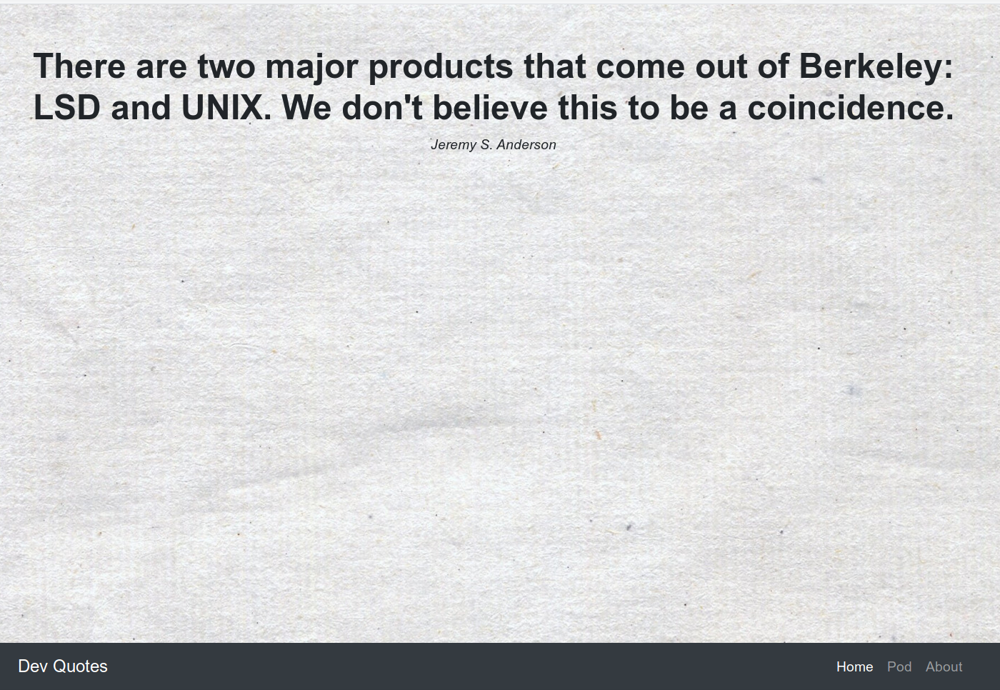
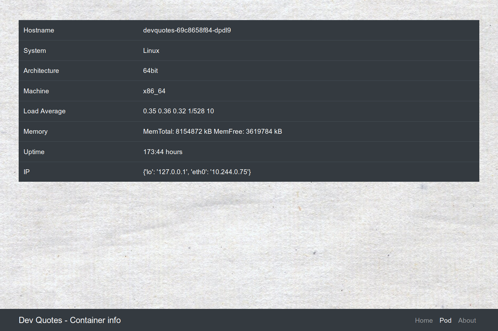

# DevQuotes

DevQuotes is a lightweight cloud native web app for kubernetes tests.

## Structure

`/`

Ramdom programming quotes



`/pod`

Display pod information



`/metrics`

Prometheus metrics

`/healthz`

Liveness health endpoint

## Usage

```
kubectl apply -f https://raw.githubusercontent.com/brokenpip3/devquotes/master/devquotes.yaml
```

## Credits

- The Školakoda api: https://programming-quotes-api.herokuapp.com/quotes/random/lang/en

- This project is ispired by <https://github.com/fntlnz/caturday> 